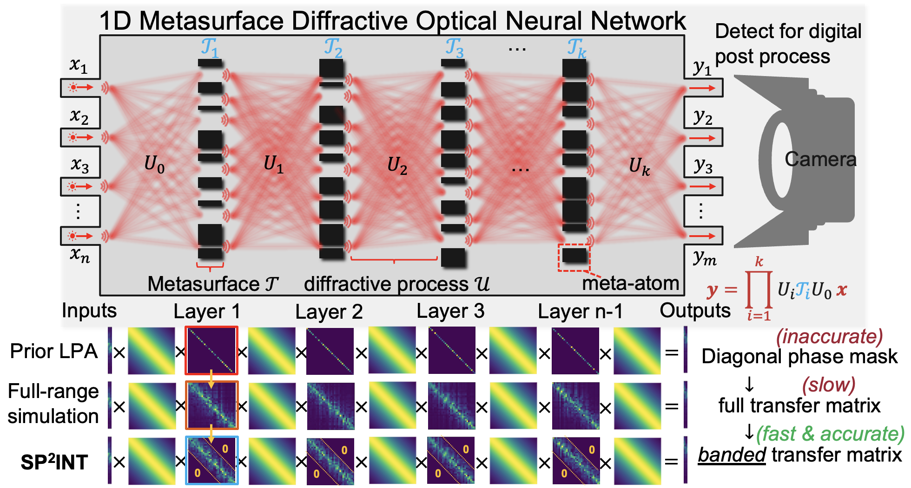
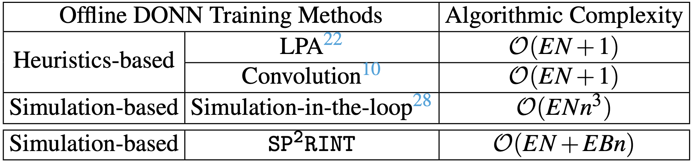
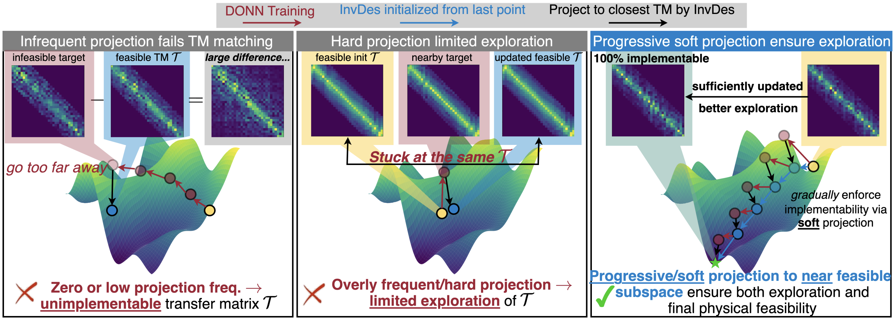
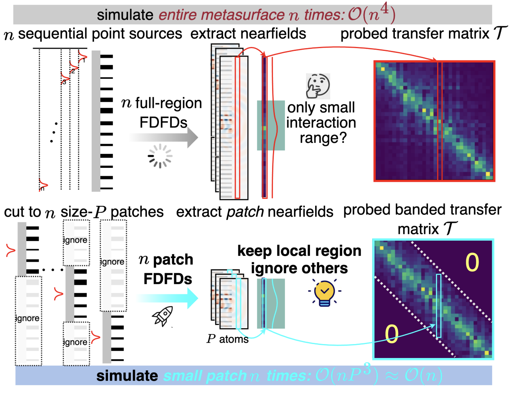
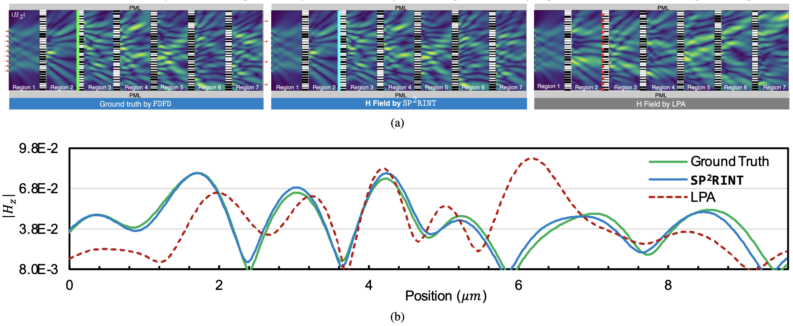
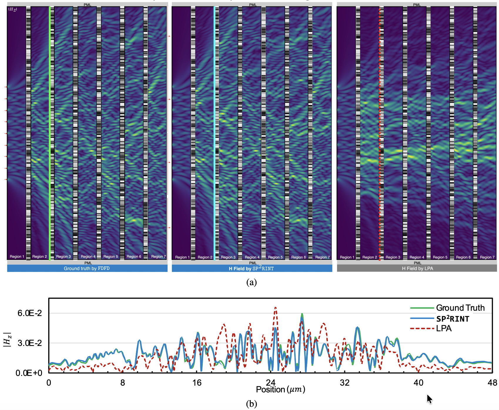
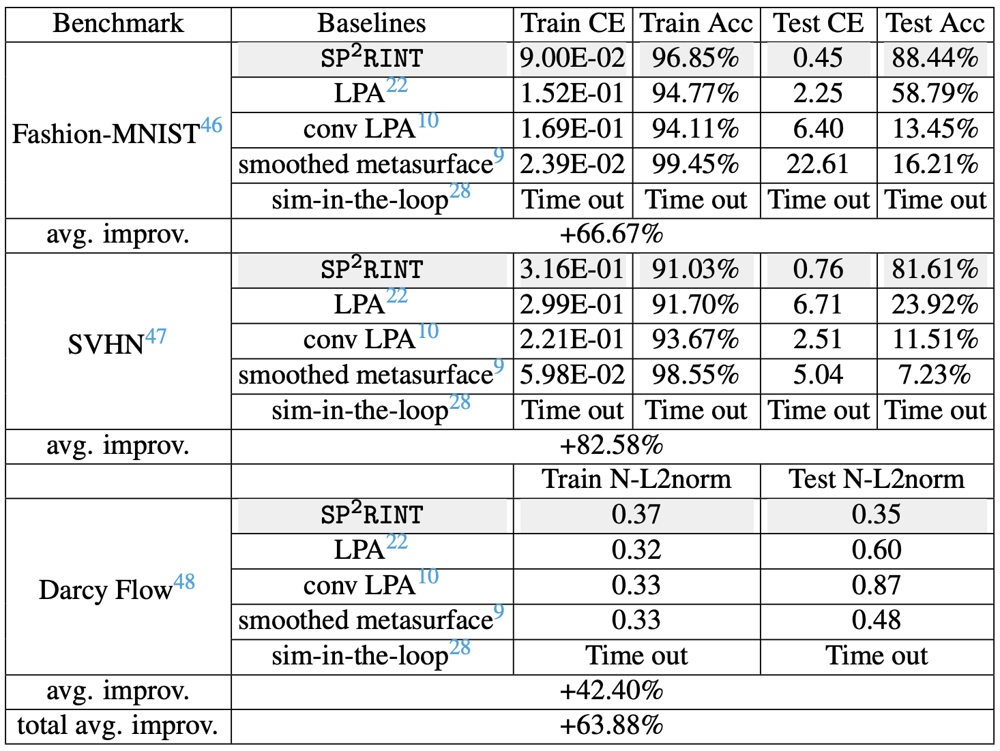

# SP<sup>2</sup>RINT: Spatially-Decoupled Physics-Constrained Progressive Inverse Optimization for Diffractive Optical Neural Network Training


By Pingchuan Ma, Ziang Yin, Qi Jing, Zhengqi Gao, Nicholas Gangi, Boyang Zhang, Tsung-Wei Huang, Zhaoran Huang, Duane S. Boning, Yu Yao and [Jiaqi Gu<sup>†</sup>](https://scopex-asu.github.io/index.html)

This repo is the official implementation of ["SP2RINT: Spatially-Decoupled Physics-Constrained Progressive Inverse Optimization for Diffractive Optical Neural Network Training"](https://arxiv.org/abs/2505.18377), ACM/IEEE Design Automation Conference (DAC), 2026.


# SP²RINT: Spatially-Decoupled Physics-Constrained Progressive Inverse Optimization for Diffractive Optical Neural Network Training

<p align="center">

</p>

**SP²RINT** is an open-source framework for **physics-constrained training of Diffractive Optical Neural Networks (DONNs)** based on scalable inverse design. Unlike conventional end-to-end simulation-in-the-loop optimization, which requires solving Maxwell's equations at every training iteration, SP²RINT reformulates DONN training as a **progressive PDE-constrained optimization problem**, alternating between differentiable network training and physics-aware inverse design.

By combining progressive physical constraint enforcement with a novel **spatially-decoupled inverse optimization** strategy, SP²RINT bridges the gap between high-level optical neural network training and fabrication-ready metasurface implementation, enabling scalable optimization of large meta-optical systems with orders-of-magnitude higher efficiency. 

---

## Motivation

Recent diffractive optical neural networks have demonstrated tremendous potential for ultra-low-latency and energy-efficient AI inference. However, existing training methodologies suffer from a fundamental tradeoff:

- **Idealized phase mask training** based on local periodicity approximation (LPA) is computationally efficient but ignores Maxwell physics, often producing physically unrealizable metasurfaces.
- **Simulation-in-the-loop optimization** directly optimizes fabrication-ready structures through adjoint electromagnetic simulation, but requires repeated PDE solves throughout neural network training, making large-scale optimization prohibitively expensive.

SP²RINT addresses this challenge by decoupling neural optimization from electromagnetic inverse design while progressively enforcing physical realizability, resulting in scalable training without sacrificing implementation fidelity. 
<p align="center">

</p>

---

## Key Features

- 🚀 **1825× faster** than conventional simulation-in-the-loop training while maintaining comparable model accuracy.
- ⚡ Progressive PDE-constrained optimization that avoids expensive electromagnetic simulation during every SGD iteration.
- 🧩 Spatially-decoupled inverse design by partitioning metasurfaces into locally independent optimization patches.
- 📈 Highly scalable optimization for large diffractive optical neural networks.
- 🔬 Produces fabrication-ready metasurface designs instead of abstract optical transfer matrices.
- 💻 GPU-accelerated PyTorch implementation with differentiable optimization pipeline.

---

## Method Overview

<p align="center">

</p>

SP²RINT consists of two alternating optimization stages:

1. **DONN Transfer Matrix Training**
   - Relax each metasurface layer into a trainable banded transfer matrix.
   - Train the optical neural network efficiently using standard backpropagation.

2. **Physics-Inspired Progressive Inverse Optimization**
   - Convert learned transfer matrices into physically realizable metasurfaces.
   - Perform adjoint-based inverse design to small metasurface patches only periodically instead of every iteration.
   - Update the network using calibrated physical responses.


To further improve scalability, SP²RINT exploits the locality of electromagnetic interactions by decomposing the metasurface into multiple independent spatial patches, allowing parallel inverse optimization and significantly reducing computational complexity.

<p align="center">

</p>

---

## Performance
On a 6-layer diffraction system consisting of 32/160-meta-atoms metasurfaces, SP²RINT shows significantly higher field simulation fidelity than LPA.
<p align="center">

</p>

<p align="center">

</p>

Across multiple DONN benchmarks, SP²RINT demonstrates

- Digital-level inference accuracy
- Physically realizable metasurface implementations
- Massive reduction in optimization cost
- Up to **1825× acceleration** over simulation-in-the-loop optimization

making previously impractical large-scale meta-optical neural network training feasible.

<p align="center">

</p>

---

## Repository Structure

```text
SP2RINT/
├── core/               # Optimization framework
├── models/             # DONN architectures
├── inverse_design/     # Adjoint inverse optimization
├── simulation/         # Electromagnetic simulation
├── utils/              # Utilities
├── configs/            # Experiment configurations
├── scripts/            # Training & evaluation scripts
└── examples/           # Example experiments
```

---

## Citing SP<sup>2</sup>RINT
```
@inproceedings{pma2026sp2rint,
  title={{SP$^2$RINT: Spatially-Decoupled Physics-Constrained Progressive Inverse Optimization for Diffractive Optical Neural Network Training}},
  author={Pingchuan Ma and Ziang Yin and Qi Jing and Zhengqi Gao and Nicholas Gangi and Boyang Zhang and Tsung-Wei Huang and Zhaoran Huang and Duane S. Boning and Yu Yao and Jiaqi Gu},
  year={2026},
  booktitle={Design Automation Conference (DAC)},
  url={https://arxiv.org/abs/2505.18377}, 
}
```
```
Pingchuan Ma, Ziang Yin, Qi Jing, Zhengqi Gao, Nicholas Gangi, Boyang Zhang, Tsung-Wei Huang, Zhaoran Huang, Duane S. Boning, Yu Yao and Jiaqi Gu, "SP2RINT: Spatially-Decoupled Physics-Constrained Progressive Inverse Optimization for Diffractive Optical Neural Network Training," Design Automation Conference (DAC), July 2026.
```
